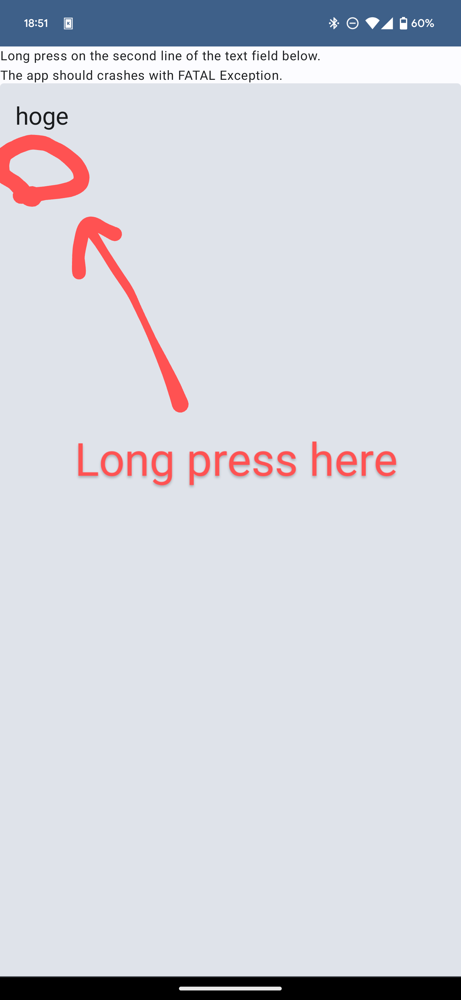

# TextField crash demo

## Issue

Trying to select an empty text with a `ParagraphStyle` on a TextField causes a crash.
This crash occurs with both `TextField` and `BasicTextField`.

## Steps to reproduce

1. Place the composable function below.
    
```kotlin
TextField(
    value = TextFieldValue("hoge\n"),
    onValueChange = {},
    modifier = Modifier
        .fillMaxWidth()
        .height(200.dp),
    visualTransformation = {
        val styledText = buildAnnotatedString {
            append(it.text)
            addStyle(
                start = 5,
                end = 5,
                style = ParagraphStyle(),
            )
        }
        TransformedText(
            styledText,
            OffsetMapping.Identity,
        )
    },
)
```

2. Long-press on the second line of the text field.



3. The app will crash with an FATAL EXCEPTION like below.

```log
FATAL EXCEPTION: main
Process: com.github.kitakkun.emptyparagraphselectioncrashdemo, PID: 26421
java.lang.IllegalArgumentException: lineIndex(4) is out of bounds [0, 4)
	at androidx.compose.ui.text.MultiParagraph.requireLineIndexInRange(MultiParagraph.kt:762)
	at androidx.compose.ui.text.MultiParagraph.getLineLeft(MultiParagraph.kt:638)
	at androidx.compose.ui.text.TextLayoutResult.getLineLeft(TextLayoutResult.kt:439)
	at androidx.compose.foundation.text.TextLayoutResultProxy.isPositionOnText-k-4lQ0M(TextLayoutResultProxy.kt:65)
	at androidx.compose.foundation.text.selection.TextFieldSelectionManager$touchSelectionObserver$1.onStart-k-4lQ0M(TextFieldSelectionManager.kt:181)
	at androidx.compose.foundation.text.LongPressTextDragObserverKt$detectDragGesturesAfterLongPressWithObserver$2.invoke-k-4lQ0M(LongPressTextDragObserver.kt:68)
	at androidx.compose.foundation.text.LongPressTextDragObserverKt$detectDragGesturesAfterLongPressWithObserver$2.invoke(LongPressTextDragObserver.kt:62)
	at androidx.compose.foundation.gestures.DragGestureDetectorKt$detectDragGesturesAfterLongPress$5$1.invokeSuspend(DragGestureDetector.kt:241)
	at kotlin.coroutines.jvm.internal.BaseContinuationImpl.resumeWith(ContinuationImpl.kt:33)
	at kotlinx.coroutines.DispatchedTaskKt.resume(DispatchedTask.kt:178)
	at kotlinx.coroutines.DispatchedTaskKt.dispatch(DispatchedTask.kt:166)
	at kotlinx.coroutines.CancellableContinuationImpl.dispatchResume(CancellableContinuationImpl.kt:397)
	at kotlinx.coroutines.CancellableContinuationImpl.resumeImpl(CancellableContinuationImpl.kt:431)
	at kotlinx.coroutines.CancellableContinuationImpl.resumeImpl$default(CancellableContinuationImpl.kt:420)
	at kotlinx.coroutines.CancellableContinuationImpl.resumeWith(CancellableContinuationImpl.kt:328)
	at androidx.compose.ui.input.pointer.SuspendingPointerInputFilter$PointerEventHandlerCoroutine$withTimeout$job$1.invokeSuspend(SuspendingPointerInputFilter.kt:624)
	at kotlin.coroutines.jvm.internal.BaseContinuationImpl.resumeWith(ContinuationImpl.kt:33)
	at kotlinx.coroutines.DispatchedTask.run(DispatchedTask.kt:106)
	at androidx.compose.ui.platform.AndroidUiDispatcher.performTrampolineDispatch(AndroidUiDispatcher.android.kt:81)
	at androidx.compose.ui.platform.AndroidUiDispatcher.access$performTrampolineDispatch(AndroidUiDispatcher.android.kt:41)
	at androidx.compose.ui.platform.AndroidUiDispatcher$dispatchCallback$1.run(AndroidUiDispatcher.android.kt:57)
	at android.os.Handler.handleCallback(Handler.java:942)
	at android.os.Handler.dispatchMessage(Handler.java:99)
	at android.os.Looper.loopOnce(Looper.java:201)
	at android.os.Looper.loop(Looper.java:288)
	at android.app.ActivityThread.main(ActivityThread.java:7918)
	at java.lang.reflect.Method.invoke(Native Method)
	at com.android.internal.os.RuntimeInit$MethodAndArgsCaller.run(RuntimeInit.java:548)
	at com.android.internal.os.ZygoteInit.main(ZygoteInit.java:936)
	Suppressed: kotlinx.coroutines.DiagnosticCoroutineContextException: [androidx.compose.ui.platform.MotionDurationScaleImpl@b524f78, androidx.compose.runtime.BroadcastFrameClock@5129651, StandaloneCoroutine{Cancelling}@65cdeb6, AndroidUiDispatcher@82a77b7]
```


